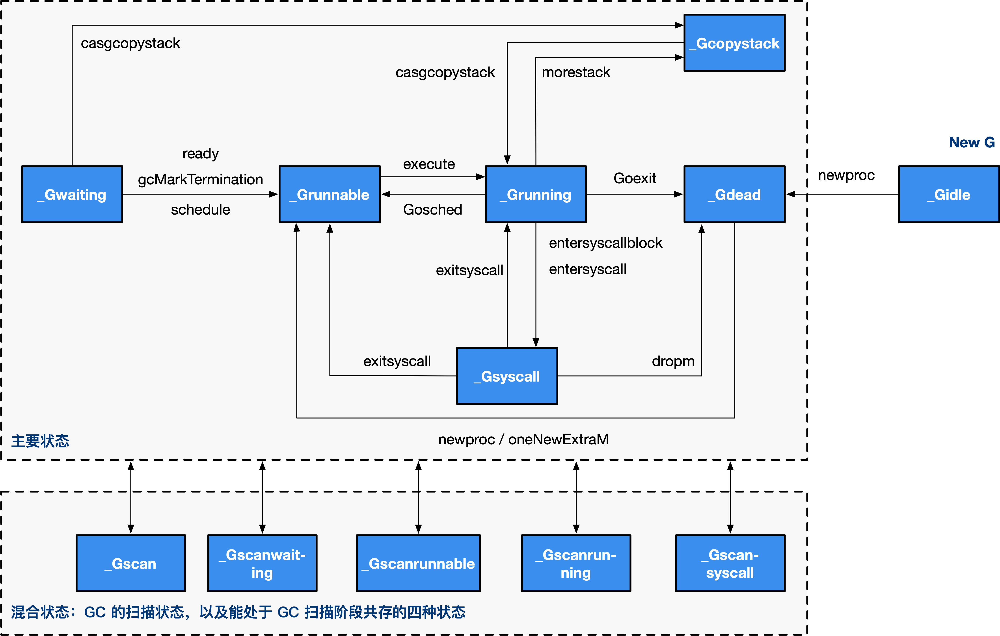

# 调度器

## 多线程计算的调度
有两种调度范式：<kbd>工作共享</kbd>和<kbd>工作窃取</kbd>

## MPG模型

- M: Machine，工作线程，即传统意义上进程的线程
- P: Processor，即一种人为抽象的、用于执行 Go 代码被要求局部资源。只有当 M 与一个 P 关联后才能执行 Go 代码。除非 M 发生阻塞或在进行系统调用时间过长时，没有与之关联的 P
- G: Goroutine，协程，即<kbd>go</kbd>关键字


## M

M 是 OS 线程的实体。我们介绍几个比较重要的字段，包括：

- 持有用于执行调度器的 g0
- 持有用于信号处理的 gsignal
- 持有线程本地存储 tls
- 持有当前正在运行的 curg
- 持有运行 Goroutine 时需要的本地资源 p
- 表示自身的自旋和非自旋状态 spining
- 管理在它身上执行的 cgo 调用
- 将自己与其他的 M 进行串联

### m结构体
```go
type m struct {
	g0          *g			// 用于执行调度指令的 Goroutine
	gsignal     *g			// 处理 signal 的 g
	tls         [6]uintptr	// 线程本地存储
	curg        *g			// 当前运行的用户 Goroutine
	p           puintptr	// 执行 go 代码时持有的 p (如果没有执行则为 nil)
	spinning    bool		// m 当前没有运行 work 且正处于寻找 work 的活跃状态
	cgoCallers  *cgoCallers	// cgo 调用崩溃的 cgo 回溯
	alllink     *m			// 在 allm 上
}
```

## P

P 的结构
P 只是处理器的抽象，而非处理器本身，它存在的意义在于实现工作窃取（work stealing）算法。 简单来说，每个 P 持有一个 G 的本地队列。

在没有 P 的情况下，所有的 G 只能放在一个全局的队列中。 当 M 执行完 G 而没有 G 可执行时，必须将队列锁住从而取值。

当引入了 P 之后，P 持有 G 的本地队列，而持有 P 的 M 执行完 G 后在 P 本地队列中没有 发现其他 G 可以执行时，虽然仍然会先检查全局队列、网络，但这时增加了一个从其他 P 的 队列偷取（steal）一个 G 来执行的过程。优先级为本地 > 全局 > 网络 > 偷取。

一个不恰当的比喻：银行服务台排队中身手敏捷的顾客，当一个服务台队列空（没有人）时， 没有在排队的顾客（全局）会立刻跑到该窗口，当彻底没人时在其他队列排队的顾客才会迅速 跑到这个没人的服务台来，即所谓的偷取。

### p结构体
```go
type p struct {
	id           int32
	status       uint32 // p 的状态 pidle/prunning/...
	link         puintptr
	m            muintptr   // 反向链接到关联的 m （nil 则表示 idle）
	mcache       *mcache
	pcache       pageCache
	deferpool    [5][]*_defer // 不同大小的可用的 defer 结构池
	deferpoolbuf [5][32]*_defer
	runqhead     uint32	// 可运行的 Goroutine 队列，可无锁访问
	runqtail     uint32
	runq         [256]guintptr
	runnext      guintptr
	timersLock   mutex
	timers       []*timer
	preempt      bool // 是否抢占，表示这个P应该进入调度器
}
```

## G

将需要执行的函数参数进行了拷贝，保存了要执行的函数体的入口地址，用于执行

### g结构体
```go
type g struct {
	stack stack	// 栈内存：[stack.lo, stack.hi)
	stackguard0	uintptr
	stackguard1 uintptr

	_panic       *_panic
	_defer       *_defer
	m            *m				// 当前的 m
	sched        gobuf
	stktopsp     uintptr		// 期望 sp 位于栈顶，用于回溯检查
	param        unsafe.Pointer // wakeup 唤醒时候传递的参数
	atomicstatus uint32
	goid         int64
	preempt      bool       	// 抢占信号，stackguard0 = stackpreempt 的副本
	timer        *timer         // 为 time.Sleep 缓存的计时器
}
```

## sched

调度器，所有 Goroutine 被调度的核心，存放了调度器持有的全局资源，访问这些资源需要持有锁：

- 管理了能够将 G 和 M 进行绑定的 M 队列
- 管理了空闲的 P 链表（队列）
- 管理了 G 的全局队列
- 管理了可被复用的 G 的全局缓存
- 管理了 defer 池

### sched结构体
```go
type schedt struct {
	lock mutex

	pidle      puintptr	// 空闲 p 链表
	npidle     uint32	// 空闲 p 数量
	nmspinning uint32	// 自旋状态的 M 的数量
	runq       gQueue	// 全局 runnable G 队列
	runqsize   int32
	gFree struct {		// 有效 dead G 的全局缓存.
		lock    mutex
		stack   gList	// 包含栈的 Gs
		noStack gList	// 没有栈的 Gs
		n       int32
	}
	sudoglock  mutex	// sudog 结构的集中缓存
	sudogcache *sudog
	deferlock  mutex	// 不同大小的有效的 defer 结构的池
	deferpool  [5]*_defer
}
```


### M初始化

M 其实就是 OS 线程，它只有两个状态：自旋、非自旋。 在调度器初始化阶段，只有一个 M，那就是主 OS 线程，因此这里的 commoninit 仅仅只是对 M 进行一个初步的初始化， 该初始化包含对 M 及用于处理 M 信号的 G 的相关运算操作，未涉及工作线程的暂止和复始。

```go
// runtime/proc.go
func mcommoninit(mp *m) {
	(...)

	lock(&sched.lock)
	(...)

	// mnext 表示当前 m 的数量，还表示下一个 m 的 id
	mp.id = sched.mnext
	// 增加 m 的数量
	sched.mnext++

	(...) // 初始化 gsignal，用于处理 m 上的信号

	// 添加到 allm 中，从而当它刚保存到寄存器或本地线程存储时候 GC 不会释放 g.m
	mp.alllink = allm

	// NumCgoCall() 会在没有使用 schedlock 时遍历 allm，等价于 allm = mp
	atomicstorep(unsafe.Pointer(&allm), unsafe.Pointer(mp))
	unlock(&sched.lock)

	(...)
}
```

### p初始化


通常情况下（在程序运行时不调整 P 的个数），P 只会在四种状态下进行切换。 当程序刚开始运行进行初始化时，所有的 P 都处于 _Pgcstop 状态， 随着 P 的初始化（runtime.procresize），会被置于 _Pidle。

当 M 需要运行时，会 runtime.acquirep，并通过 runtime.releasep 来释放。 当 G 执行时需要进入系统调用时，P 会被设置为 _Psyscall， 如果这个时候被系统监控抢夺（runtime.retake），则 P 会被重新修改为 _Pidle。 如果在程序运行中发生 GC，则 P 会被设置为 _Pgcstop， 并在 runtime.startTheWorld 时重新调整为 _Pidle 或者 _Prunning。

```go
func procresize(nprocs int32) *p {
	// 获取先前的 P 个数
	old := gomaxprocs
	(...)

	// 更新统计信息，记录此次修改 gomaxprocs 的时间
	now := nanotime()
	if sched.procresizetime != 0 {
		sched.totaltime += int64(old) * (now - sched.procresizetime)
	}
	sched.procresizetime = now

	// 必要时增加 allp
	// 这个时候本质上是在检查用户代码是否有调用过 runtime.MAXGOPROCS 调整 p 的数量
	// 此处多一步检查是为了避免内部的锁，如果 nprocs 明显小于 allp 的可见数量（因为 len）
	// 则不需要进行加锁
	if nprocs > int32(len(allp)) {
		// 此处与 retake 同步，它可以同时运行，因为它不会在 P 上运行。
		lock(&allpLock)
		if nprocs <= int32(cap(allp)) {
			// 如果 nprocs 被调小了，扔掉多余的 p
			allp = allp[:nprocs]
		} else {
			// 否则（调大了）创建更多的 p
			nallp := make([]*p, nprocs)
			// 将原有的 p 复制到新创建的 new all p 中，不浪费旧的 p
			copy(nallp, allp[:cap(allp)])
			allp = nallp
		}
		unlock(&allpLock)
	}

	// 初始化新的 P
	for i := old; i < nprocs; i++ {
		pp := allp[i]

		// 如果 p 是新创建的(新创建的 p 在数组中为 nil)，则申请新的 P 对象
		if pp == nil {
			pp = new(p)
		}
		pp.init(i)
		atomicstorep(unsafe.Pointer(&allp[i]), unsafe.Pointer(pp)) // allp[i] = pp
	}

	_g_ := getg()
	// 如果当前正在使用的 P 应该被释放，则更换为 allp[0]
	// 否则是初始化阶段，没有 P 绑定当前 P allp[0]
	if _g_.m.p != 0 && _g_.m.p.ptr().id < nprocs {
		// 继续使用当前 P
		_g_.m.p.ptr().status = _Prunning
		(...)
	} else {
		// 释放当前 P，因为已失效
		if _g_.m.p != 0 {
			_g_.m.p.ptr().m = 0
		}
		_g_.m.p = 0
		_g_.m.mcache = nil

		// 更换到 allp[0]
		p := allp[0]
		p.m = 0
		p.status = _Pidle
		acquirep(p) // 直接将 allp[0] 绑定到当前的 M

		(...)
	}

	// 从未使用的 p 释放资源
	for i := nprocs; i < old; i++ {
		p := allp[i]
		p.destroy()
		// 不能释放 p 本身，因为他可能在 m 进入系统调用时被引用
	}


	// 清理完毕后，修剪 allp, nprocs 个数之外的所有 P
	if int32(len(allp)) != nprocs {
		lock(&allpLock)
		allp = allp[:nprocs]
		unlock(&allpLock)
	}

	// 将没有本地任务的 P 放到空闲链表中
	var runnablePs *p
	for i := nprocs - 1; i >= 0; i-- {
		// 挨个检查 p
		p := allp[i]

		// 确保不是当前正在使用的 P
		if _g_.m.p.ptr() == p {
			continue
		}

		// 将 p 设为 idel
		p.status = _Pidle
		if runqempty(p) {
			// 放入 idle 链表
			pidleput(p)
		} else {
			// 如果有本地任务，则为其绑定一个 M
			p.m.set(mget())
			// 第一个循环为 nil，后续则为上一个 p
			// 此处即为构建可运行的 p 链表
			p.link.set(runnablePs)
			runnablePs = p
		}
	}
	stealOrder.reset(uint32(nprocs))
	atomic.Store((*uint32)(unsafe.Pointer(gomaxprocs)), uint32(nprocs)) // gomaxprocs = nprocs
	return runnablePs // 返回所有包含本地任务的 P 链表
}

// 初始化 pp，
func (pp *p) init(id int32) {
	// p 的 id 就是它在 allp 中的索引
	pp.id = id
	// 新创建的 p 处于 _Pgcstop 状态
	pp.status = _Pgcstop
	(...)

	// 为 P 分配 cache 对象
	if pp.mcache == nil {
		// 如果 old == 0 且 i == 0 说明这是引导阶段初始化第一个 p
		if id == 0 {
			(...)
			pp.mcache = getg().m.mcache // bootstrap
		} else {
			pp.mcache = allocmcache()
		}
	}
	(...)
}

// 释放未使用的 P，一般情况下不会执行这段代码
func (pp *p) destroy() {
	// 将所有 runnable Goroutine 移动至全局队列
	for pp.runqhead != pp.runqtail {
		// 从本地队列中 pop
		pp.runqtail--
		gp := pp.runq[pp.runqtail%uint32(len(pp.runq))].ptr()
		// push 到全局队列中
		globrunqputhead(gp)
	}
	if pp.runnext != 0 {
		globrunqputhead(pp.runnext.ptr())
		pp.runnext = 0
	}
	(...)
	// 将当前 P 的空闲的 G 复链转移到全局
	gfpurge(pp)
	(...)
	pp.status = _Pdead
}
```

procresize 这个函数相对较长，我们来总结一下它主要干了什么事情：

调用时已经 STW，记录调整 P 的时间；
按需调整 allp 的大小；
按需初始化 allp 中的 P；
如果当前的 P 还可以继续使用（没有被移除），则将 P 设置为 _Prunning；
否则将第一个 P 抢过来给当前 G 的 M 进行绑定
从 allp 移除不需要的 P，将释放的 P 队列中的任务扔进全局队列；
最后挨个检查 P，将没有任务的 P 放入 idle 队列
除去当前 P 之外，将有任务的 P 彼此串联成链表，将没有任务的 P 放回到 idle 链表中
显然，在运行 P 初始化之前，我们刚刚初始化完 M，因此第 7 步中的绑定 M 会将当前的 P 绑定到初始 M 上。 而后由于程序刚刚开始，P 队列是空的，所以他们都会被链接到可运行的 P 链表上处于 _Pidle 状态。

### g初始化

```go
//go:nosplit
func newproc(siz int32, fn *funcval) {
	// 从 fn 的地址增加一个指针的长度，从而获取第一参数地址
	argp := add(unsafe.Pointer(&fn), sys.PtrSize)
	gp := getg()
	pc := getcallerpc() // 获取调用方 PC/IP 寄存器值

	// 用 g0 系统栈创建 Goroutine 对象
	// 传递的参数包括 fn 函数入口地址, argp 参数起始地址, siz 参数长度, gp（g0），调用方 pc（goroutine）
	systemstack(func() {
		newproc1(fn, (*uint8)(argp), siz, gp, pc)
	})
}
type funcval struct {
	fn uintptr
	// 变长大小，fn 的数据在应在 fn 之后
}
// getcallerpc 返回它调用方的调用方程序计数器 PC program conter
//go:noescape
func getcallerpc() uintptr
```
这部分需要编译器配合获取newproc1的参数

```go
// 创建一个运行 fn 的新 g，具有 narg 字节大小的参数，从 argp 开始。
// callerps 是 go 语句的起始地址。新创建的 g 会被放入 g 的队列中等待运行。
func newproc1(fn *funcval, argp *uint8, narg int32, callergp *g, callerpc uintptr) {
	_g_ := getg() // 因为是在系统栈运行所以此时的 g 为 g0
	(...)

	_g_.m.locks++ // 禁止这时 g 的 m 被抢占因为它可以在一个局部变量中保存 p
	siz := narg
	siz = (siz + 7) &^ 7
	(...)

	// 获得 p
	_p_ := _g_.m.p.ptr()
	// 根据 p 获得一个新的 g
	newg := gfget(_p_)

	// 初始化阶段，gfget 是不可能找到 g 的
	// 也可能运行中本来就已经耗尽了
	if newg == nil {
		// 创建一个拥有 _StackMin 大小的栈的 g
		newg = malg(_StackMin)
		// 将新创建的 g 从 _Gidle 更新为 _Gdead 状态
		casgstatus(newg, _Gidle, _Gdead)
		allgadd(newg) // 将 Gdead 状态的 g 添加到 allg，这样 GC 不会扫描未初始化的栈
	}
	(...)

	// 计算运行空间大小，对齐
	totalSize := 4*sys.RegSize + uintptr(siz) + sys.MinFrameSize // extra space in case of reads slightly beyond frame
	totalSize += -totalSize & (sys.SpAlign - 1)                  // align to spAlign

	// 确定 sp 和参数入栈位置
	sp := newg.stack.hi - totalSize
	spArg := sp
	(...)

	// 处理参数，当有参数时，将参数拷贝到 Goroutine 的执行栈中
	if narg > 0 {
		// 从 argp 参数开始的位置，复制 narg 个字节到 spArg（参数拷贝）
		memmove(unsafe.Pointer(spArg), unsafe.Pointer(argp), uintptr(narg))
		// 栈到栈的拷贝。
		// 如果启用了 write barrier 并且 源栈为灰色（目标始终为黑色），
		// 则执行 barrier 拷贝。
		// 因为目标栈上可能有垃圾，我们在 memmove 之后执行此操作。
		if writeBarrier.needed && !_g_.m.curg.gcscandone {
			f := findfunc(fn.fn)
			stkmap := (*stackmap)(funcdata(f, _FUNCDATA_ArgsPointerMaps))
			if stkmap.nbit > 0 {
				// 我们正位于序言部分，因此栈 map 索引总是 0
				bv := stackmapdata(stkmap, 0)
				bulkBarrierBitmap(spArg, spArg, uintptr(bv.n)*sys.PtrSize, 0, bv.bytedata)
			}
		}
	}

	// 清理、创建并初始化的 g 的运行现场
	memclrNoHeapPointers(unsafe.Pointer(&newg.sched), unsafe.Sizeof(newg.sched))
	newg.sched.sp = sp
	newg.stktopsp = sp
	newg.sched.pc = funcPC(goexit) + sys.PCQuantum // +PCQuantum 从而前一个指令还在相同的函数内
	newg.sched.g = guintptr(unsafe.Pointer(newg))
	gostartcallfn(&newg.sched, fn)

	// 初始化 g 的基本状态
	newg.gopc = callerpc
	newg.ancestors = saveAncestors(callergp) // 调试相关，追踪调用方
	newg.startpc = fn.fn                     // 入口 pc
	(...)

	newg.gcscanvalid = false
	// 现在将 g 更换为 _Grunnable 状态
	casgstatus(newg, _Gdead, _Grunnable)

	// 分配 goid
	if _p_.goidcache == _p_.goidcacheend {
		// Sched.goidgen 为最后一个分配的 id，相当于一个全局计数器
		// 这一批必须为 [sched.goidgen+1, sched.goidgen+GoidCacheBatch].
		// 启动时 sched.goidgen=0, 因此主 Goroutine 的 goid 为 1
		_p_.goidcache = atomic.Xadd64(&sched.goidgen, _GoidCacheBatch)
		_p_.goidcache -= _GoidCacheBatch - 1
		_p_.goidcacheend = _p_.goidcache + _GoidCacheBatch
	}
	newg.goid = int64(_p_.goidcache)
	_p_.goidcache++
	(...)

	// 将这里新创建的 g 放入 p 的本地队列或直接放入全局队列
	// true 表示放入执行队列的下一个，false 表示放入队尾
	runqput(_p_, newg, true)

	// 如果有空闲的 P、且 spinning 的 M 数量为 0，且主 Goroutine 已经开始运行，则进行唤醒 p
	// 初始化阶段 mainStarted 为 false，所以 p 不会被唤醒
	if atomic.Load(&sched.npidle) != 0 && atomic.Load(&sched.nmspinning) == 0 && mainStarted {
		wakep()
	}
	releasem(_g_.m)
}
//go:nosplit
func releasem(mp *m) {
	_g_ := getg()
	mp.locks--
	if mp.locks == 0 && _g_.preempt {
		// 如果我们在 newstack 中清除了抢占请求，则恢复抢占请求
		_g_.stackguard0 = stackPreempt
	}
}
```

创建 G 的过程也是相对比较复杂的，我们来总结一下这个过程：

1. 首先尝试从 P 本地 gfree 链表或全局 gfree 队列获取已经执行过的 g
2. 初始化过程中程序无论是本地队列还是全局队列都不可能获取到 g，因此创建一个新的 g，并为其分配运行线程（执行栈），这时 g 处于 _Gidle 状态
3. 创建完成后，g 被更改为 _Gdead 状态，并根据要执行函数的入口地址和参数，初始化执行栈的 SP 和参数的入栈位置，并将需要的参数拷贝一份存入执行栈中
4. 根据 SP、参数，在 g.sched 中保存 SP 和 PC 指针来初始化 g 的运行现场
5. 将调用方、要执行的函数的入口 PC 进行保存，并将 g 的状态更改为 _Grunnable
6. 给 Goroutine 分配 id，并将其放入 P 本地队列的队头或全局队列（初始化阶段队列肯定不是满的，因此不可能放入全局队列）
7. 检查空闲的 P，将其唤醒，准备执行 G，但我们目前处于初始化阶段，主 Goroutine 尚未开始执行，因此这里不会唤醒 P。