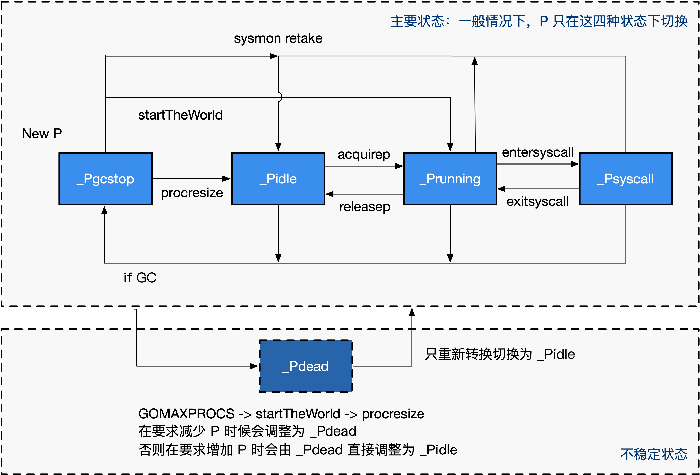

# 调度器

## MPG模型

- M: Machine，工作线程，即传统意义上进程的线程
- P: Processor，即一种人为抽象的、用于执行 Go 代码被要求局部资源。只有当 M 与一个 P 关联后才能执行 Go 代码。除非 M 发生阻塞或在进行系统调用时间过长时，没有与之关联的 P
- G: Goroutine，协程，即<kbd>go</kbd>关键字


工作窃取算法  

go内存分配，向os申请一块内存，这些内存主要用在三方面：  
1. 栈内存
2. 用于runtime使用的堆内存
3. 用于用户态代码使用的go堆  


## M

M 是 OS 线程的实体。我们介绍几个比较重要的字段，包括：

- 持有用于执行调度器的 g0
- 持有用于信号处理的 gsignal
- 持有线程本地存储 tls
- 持有当前正在运行的 curg
- 持有运行 Goroutine 时需要的本地资源 p
- 表示自身的自旋和非自旋状态 spining
- 管理在它身上执行的 cgo 调用
- 将自己与其他的 M 进行串联

```go
type m struct {
	g0          *g			// 用于执行调度指令的 Goroutine
	gsignal     *g			// 处理 signal 的 g
	tls         [6]uintptr	// 线程本地存储
	curg        *g			// 当前运行的用户 Goroutine
	p           puintptr	// 执行 go 代码时持有的 p (如果没有执行则为 nil)
	spinning    bool		// m 当前没有运行 work 且正处于寻找 work 的活跃状态
	cgoCallers  *cgoCallers	// cgo 调用崩溃的 cgo 回溯
	alllink     *m			// 在 allm 上
}
```

# P

P 的结构
P 只是处理器的抽象，而非处理器本身，它存在的意义在于实现工作窃取（work stealing）算法。 简单来说，每个 P 持有一个 G 的本地队列。

在没有 P 的情况下，所有的 G 只能放在一个全局的队列中。 当 M 执行完 G 而没有 G 可执行时，必须将队列锁住从而取值。

当引入了 P 之后，P 持有 G 的本地队列，而持有 P 的 M 执行完 G 后在 P 本地队列中没有 发现其他 G 可以执行时，虽然仍然会先检查全局队列、网络，但这时增加了一个从其他 P 的 队列偷取（steal）一个 G 来执行的过程。优先级为本地 > 全局 > 网络 > 偷取。

一个不恰当的比喻：银行服务台排队中身手敏捷的顾客，当一个服务台队列空（没有人）时， 没有在排队的顾客（全局）会立刻跑到该窗口，当彻底没人时在其他队列排队的顾客才会迅速 跑到这个没人的服务台来，即所谓的偷取。

### p结构体
```go
type p struct {
	id           int32
	status       uint32 // p 的状态 pidle/prunning/...
	link         puintptr
	m            muintptr   // 反向链接到关联的 m （nil 则表示 idle）
	mcache       *mcache
	pcache       pageCache
	deferpool    [5][]*_defer // 不同大小的可用的 defer 结构池
	deferpoolbuf [5][32]*_defer
	runqhead     uint32	// 可运行的 Goroutine 队列，可无锁访问
	runqtail     uint32
	runq         [256]guintptr
	runnext      guintptr
	timersLock   mutex
	timers       []*timer
	preempt      bool // 是否抢占，表示这个P应该进入调度器
}
```
### 状态转换图


# G

将需要执行的函数参数进行了拷贝，保存了要执行的函数体的入口地址，用于执行

### g结构体
```go
type g struct {
	stack stack	// 栈内存：[stack.lo, stack.hi)
	stackguard0	uintptr
	stackguard1 uintptr

	_panic       *_panic
	_defer       *_defer
	m            *m				// 当前的 m
	sched        gobuf
	stktopsp     uintptr		// 期望 sp 位于栈顶，用于回溯检查
	param        unsafe.Pointer // wakeup 唤醒时候传递的参数
	atomicstatus uint32
	goid         int64
	preempt      bool       	// 抢占信号，stackguard0 = stackpreempt 的副本
	timer        *timer         // 为 time.Sleep 缓存的计时器
}
```

### 状态转换图


```go
type schedt struct {
	lock mutex

	pidle      puintptr	// 空闲 p 链表
	npidle     uint32	// 空闲 p 数量
	nmspinning uint32	// 自旋状态的 M 的数量
	runq       gQueue	// 全局 runnable G 队列
	runqsize   int32
	gFree struct {		// 有效 dead G 的全局缓存.
		lock    mutex
		stack   gList	// 包含栈的 Gs
		noStack gList	// 没有栈的 Gs
		n       int32
	}
	sudoglock  mutex	// sudog 结构的集中缓存
	sudogcache *sudog
	deferlock  mutex	// 不同大小的有效的 defer 结构的池
	deferpool  [5]*_defer
}
```